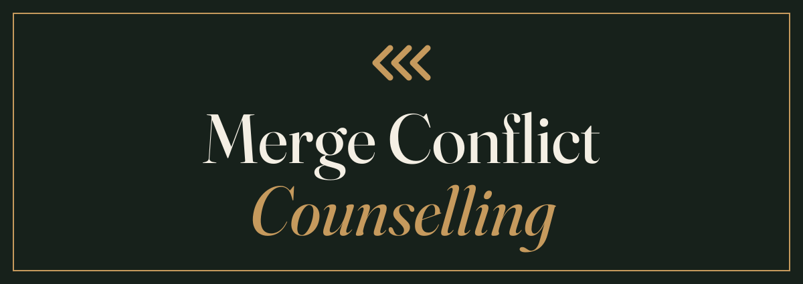

<p align="center">
  
</p>

<p align="center">
  <strong>A safe space for your working tree.</strong><br>
  Both sides heard. Neither chosen.
</p>

---

This repository contains the public site for Merge Conflict Counselling
(mergeconflictcounselling.com), a therapeutic practice for branches that can
no longer be merged without help.

## The Practice

We provide a calm, judgement-free space for two versions of the same file to
be heard in full. We do not take sides, we do not recommend a resolution
strategy, and we have never once suggested that one branch is more correct
than the other — a position we hold sincerely and also because we are not
qualified to say. Sessions run fifty minutes, both parties must be fetched
beforehand, and the common ancestor is always invited, because it remembers
what the file was for. Most conflicts resolve eventually. The ones that do
not are welcome to keep coming.

---

## Development notes

The parody ends here. The rest of this file is accurate.

### Layout

A static site plus one small Pages Function. Two HTML files, five fonts, a
shell script and a handful of generated images. There is no framework, no
bundler and no `package.json`. Cloudflare Pages serves the repository root
exactly as it appears here — except `functions/`, which Wrangler compiles
into the Functions worker and never uploads as a static asset.

```
index.html                 the site
404.html                   catch-all, served automatically by Cloudflare Pages
counsel                    the mergetool, served at /counsel as text/plain
functions/crisis.js        GET /crisis — the crisis line, a Pages Function
favicon.svg                icon source of truth (64px grid)
favicon.ico                16/32/48, generated
apple-touch-icon.png       180x180, generated
og.png                     1200x630 share image, generated
assets/logo.svg            wordmark, text outlined, used at the top of this README
fonts/                     self-hosted woff2, latin subset
tools/og.html              source for og.png
tools/logo-src.svg         source for assets/logo.svg, text still live
tools/favicon-16.svg       pixel-grid 16px icon, used for the smallest .ico entry
Makefile                   asset regeneration only, never runs at deploy time
_headers                   Cloudflare Pages header rules
robots.txt                 permissive
wrangler.toml              Cloudflare Pages configuration
```

The page makes zero requests to any external domain. Fraunces, Karla and IBM
Plex Mono are self-hosted under `fonts/`; Fraunces and Karla are variable
fonts, so one file each covers every weight the design uses, and only the
italic axis needs a second Fraunces file. Five files, about 200 KB in total.

`_headers` caches `/fonts/*` for a year as `immutable`, so **replacing a font
means renaming the file too** — otherwise clients keep serving the old one.

### The production domain

`mergeconflictcounselling.com` is a placeholder until the domain is actually
registered. It is hardcoded, deliberately, in four places, and nothing derives
it from anything else:

| File | What to change |
| --- | --- |
| `index.html` | `rel=canonical`, `og:url`, `og:image`, `twitter:image` |
| `404.html` | nothing — the 404 uses only root-relative paths |
| `tools/og.html` | the domain printed in the footer of the share image |
| `README.md` | this table, and the two mentions above it |

After changing `tools/og.html`, re-run `make og`.

### Local preview

```sh
make serve          # python3 -m http.server 8000
```

Then open `http://localhost:8000`. A local server is required rather than
opening the file directly, because the font and icon paths are root-absolute.
`_headers` is applied by Cloudflare, not by the local server, so caching
behaviour will not show up here.

### Regenerating images

Only needed when the tagline, the wordmark or the icon changes. Requires
`google-chrome`, ImageMagick 7 (`magick`) and Inkscape on the machine doing
the regenerating — **none of them is needed to deploy**, because the outputs
are committed.

```sh
make assets         # everything below
make og             # og.png     <- tools/og.html, via headless Chrome
make favicon        # favicon.ico + apple-touch-icon.png <- the SVG sources
make logo           # assets/logo.svg <- tools/logo-src.svg, text outlined
```

`make og` loads the fonts from `fonts/` over `file://`, which is why the
Chrome invocation passes `--allow-file-access-from-files`. It screenshots at
exactly 1200x630 and quantises the result to 64 colours, which keeps the file
around 21 KB. The tagline is duplicated between `index.html` and
`tools/og.html`; nothing links the two.

`make logo` outlines the wordmark's text so the README renders the same
whether or not the viewer has Fraunces. Two caveats, both load-bearing:

- **Inkscape needs a real Fraunces on the fontconfig path.** The repo ships
  only the woff2 subset, which Inkscape cannot read, and Fraunces is not
  installed on this machine. The committed `assets/logo.svg` was produced by
  taking the variable TTFs from
  [google/fonts](https://github.com/google/fonts/tree/main/ofl/fraunces),
  pinning them (roman at wght 440, italic at wght 420, opsz 104) with
  `fontTools.varLib.instancer`, and pointing a scoped `FONTCONFIG_FILE` at
  the results for the duration of the export. Nothing was installed
  system-wide.
- Inkscape rewrites the whole file, so the `GENERATED` comment at the top has
  to be pasted back afterwards.

Fraunces, Karla and IBM Plex Mono are all SIL Open Font License 1.1.

### The mergetool

`/counsel` is a POSIX shell script, served as `text/plain` (a `_headers` rule;
extensionless files default to `application/octet-stream`). Installed, it is a
real `git mergetool` backend:

```sh
curl -fsS https://mergeconflictcounselling.com/counsel -o ~/.local/bin/counsel
chmod +x ~/.local/bin/counsel
git config --global mergetool.counsel.cmd 'counsel "$BASE" "$LOCAL" "$REMOTE" "$MERGED"'
git config --global mergetool.counsel.trustExitCode true
```

Then, mid-conflict:

```sh
git mergetool --tool=counsel
```

It holds a session over the first conflict hunk — quotes both sides, consults
the common ancestor (visible when `merge.conflictStyle` is `diff3`/`zdiff3`,
politely absent otherwise), assigns the homework — and exits 1 without
touching the file. `trustExitCode` makes git treat that as an unresolved
merge and restore the conflict, which is the treatment model working as
intended.

Details that matter if you edit it:

- Sessions are paced with sleeps; `COUNSEL_FAST=1` skips them, and they are
  skipped automatically when stdout is not a tty.
- The week number persists in `${XDG_STATE_HOME:-~/.local/state}/counsel/week`
  and increments per session, globally. Therapy is ongoing.
- Run with no arguments, it prints its own install instructions instead of
  holding a session.
- It never writes to `$MERGED`. The exit code does all the work.

### The crisis line

```sh
curl https://mergeconflictcounselling.com/crisis
```

`functions/crisis.js` is the only backend code in the repository: a Pages
Function returning deterministic `text/plain` first aid for detached HEAD,
served with `cache-control: no-store`. Wrangler bundles `functions/` on
deploy; nothing else changes about the deployment.

Local preview of the Function needs Wrangler rather than `make serve`:

```sh
wrangler pages dev        # serves the site with /crisis on :8788
```

Note that `wrangler pages dev` serves `functions/crisis.js` as a static file
too — production does not, Wrangler's Pages upload skips `functions/`
entirely. And `compatibility_date` in `wrangler.toml` is pinned to the newest
date the local workerd can simulate, not to today; bumping it past the
installed binary breaks `wrangler pages dev` with a "newest date supported"
error.

### Deploying

Wrangler is configured via `wrangler.toml`, so a deploy is one command from an
authenticated shell:

```sh
make deploy         # wrangler pages deploy .
```

### Which Cloudflare account this deploys to

This machine has two Cloudflare identities, and picking the wrong one deploys
this site into an unrelated organisation.

**Pages configuration cannot pin the account.** `account_id` is a Workers-only
key; putting it in a Pages `wrangler.toml` makes Wrangler refuse to run:

```
Configuration file for Pages projects does not support "account_id"
```

So the account is selected by **an auth profile bound to this directory**,
recorded in `~/.config/.wrangler/profiles/directory-bindings.json`:

```sh
wrangler auth activate personal    # already done; re-run after moving the repo
wrangler whoami                    # must print: Active profile: personal
```

Without a binding, Wrangler falls back to the `default` profile, which here is
the other organisation — and it will deploy there without asking. **Check
`whoami` before deploying.** The binding lives outside the repo, so a fresh
clone, a moved directory, or another machine all need `wrangler auth activate`
again.

One extra trap: Wrangler caches the resolved account in the untracked
`.wrangler/cache/wrangler-account.json` inside this directory. If a deploy ever
went to the wrong account from here, activating the right profile is **not**
enough — delete `.wrangler/` as well, or the cached account ID wins and the API
call fails with `Authentication error [code: 10000]`.

For CI, where profiles do not exist, set `CLOUDFLARE_ACCOUNT_ID` (the account to
deploy into) and `CLOUDFLARE_API_TOKEN` (credentials scoped to it) as
environment variables.

The Pages project is `mergeconflictcounselling`, production branch `main`, with
no build command and the build output directory set to `/`. If you ever
recreate it from the dashboard, use exactly those values — there is nothing to
build, and any build command entered there will only make the deployment worse.

To wire the Git integration instead, connect the
`holthe/merge-conflict-counselling` repository under **Workers & Pages →
Create → Pages → Connect to Git** with the same settings. Note that the
repository name is hyphenated and the Pages project name is not; the project
name matches the domain.

### Custom domain

Deploy at least once first, so the project exists. Then, depending on where
`mergeconflictcounselling.com` is registered:

**If the domain was bought through Cloudflare**, the zone is already in the
same account and nothing needs moving. Go straight to step 3.

**If it is at an external registrar** (Simply.com, as with
besteffortindustries.com):

1. **Add the zone to Cloudflare.** Dashboard → **Add a site** →
   `mergeconflictcounselling.com` → Free plan. Cloudflare returns two assigned
   nameservers of the form `xxx.ns.cloudflare.com`.
2. **Repoint the nameservers at the registrar.** Replace the registrar's
   nameservers with the two Cloudflare ones. Propagation is usually well under
   an hour; Cloudflare emails when the zone goes active.
3. **Attach the domain to the Pages project.** Dashboard → **Workers & Pages**
   → `mergeconflictcounselling` → **Custom domains** → **Set up a custom
   domain** → `mergeconflictcounselling.com`. Because the zone is on
   Cloudflare, the record is created for you:

   | Type  | Name | Content                                      | Proxy   |
   | ----- | ---- | -------------------------------------------- | ------- |
   | CNAME | `@`  | `mergeconflictcounselling.pages.dev`          | Proxied |

   The apex record is flattened by Cloudflare, so a CNAME at `@` is valid here
   even though it would not be at a conventional DNS host.

   **Do not create the record by hand first.** Adding the custom domain is what
   registers the hostname with the project, creates the record, and provisions
   the certificate — all three. A pre-existing CNAME blocks the flow outright
   ("You cannot create a Custom Domain on a hostname with an existing CNAME DNS
   record").
4. **Repeat for `www`** if both should resolve, or send `www` to the apex with
   a Redirect Rule fired against a proxied `AAAA` record for `www` pointing at
   `100::`.
5. **Wait for the certificate.** Issuance normally completes within a few
   minutes of the record appearing.

Until then the site is reachable at `mergeconflictcounselling.pages.dev`.

### Related

Best Effort Industries lists this as division 005, currently **Coming soon**.
Taking it live is a four-step edit to the table in that repository's
`index.html`; the procedure is in an HTML comment directly above the table.

## License

Parody. The practice does not exist, is not licensed, and would not be
qualified to help you if it did. Fraunces, Karla and IBM Plex Mono are
licensed under the SIL Open Font License 1.1 and are redistributed here under
those terms.
